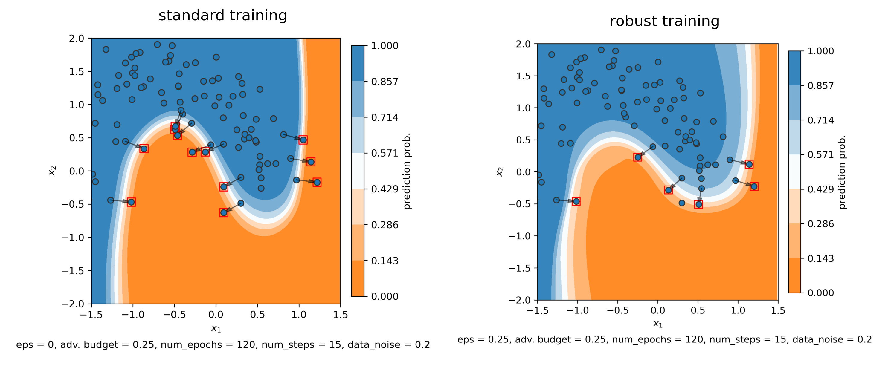

# robust neural ODEs

The code implements the gradient regularization method of robust training in the setting of neural ODEs.

Various jupyter notebooks are included that generate plots comparing standard to robust training for 2d point clouds.

A good starting point is robustness_plots.ipynb

Code is based on https://github.com/borjanG/2021-dynamical-systems
that uses the torchdiffeq package https://github.com/rtqichen/torchdiffeq